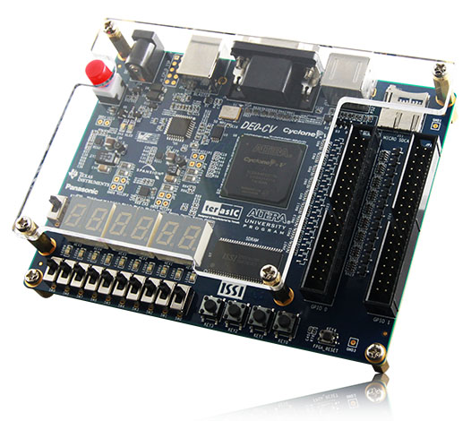

# FPGA-Labs

Solutions of the Intel [Digital Logic FPGA Academy labs ](https://fpgacademy.org/courses.html)

# Our Board

## Documentation

| Labs | Status    | Tested on board? |
| ---- | --------- | ---------------- |
| lab1 | completed | ❌               |
| lab2 | completed | ✅               |
| lab3 |           |                  |
| lab4 |           |                  |
| lab5 |           |                  |
| lab6 |           |                  |
| lab7 |           |                  |
| lab8 |           |                  |
| lab9 |           |                  |
| labA |           |                  |
| labB |           |                  |
| labC |           |                  |
| labD |           |                  |

## Authors

- [@Rufaida-Kassem](https://www.github.com/Rufaida-Kassem)
- [@Muhamed-Sayed](https://www.github.com/Muhamed-Sayed)
- [@Ahmed-ata112](https://www.github.com/Ahmed-ata112)
